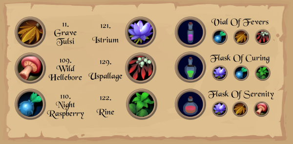

# Potion Creator
​Potion creator is a little experiment I created to play around with a recipe system and try out a liquid shader.

# Liquid shader
Based on the awesome work of [Minions Art](https://www.patreon.com/posts/shader-part-2-24996282)

# Assets

## Feel
Feedbacks are used throughout the project. Feel is a required paid asset and is not available in the repo.

## Cartoon FX Free
Can be downloaded from [Asset Store](https://api.unity.com/v1/oauth2/authorize?client_id=asset_store_v2&locale=en_US&redirect_uri=https%3A%2F%2Fassetstore.unity.com%2Fauth%2Fcallback%3Fredirect_to%3D%252Fpackages%252Fvfx%252Fparticles%252Fcartoon-fx-free-109565&response_type=code&state=efd59fa8-4181-4121-bc29-98414b3bed5c). Not included in repo.

## Ingredients

## Demo
https://user-images.githubusercontent.com/18633196/128764915-738ee72d-ab66-4fb8-9fc6-6aa118662043.mp4

